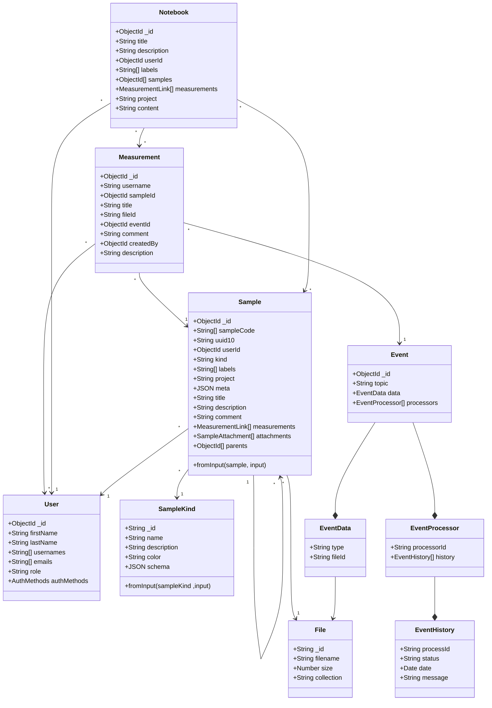

# myLIMS

> Electronic lab notebook for open science

- [Installation](#installation)
- [Configuration](#configuration)
- [Run](#run)
  - [Development](#development)
  - [Production](#production)
- [Design](#design)
  - [Core](#core)
  - [Addons](#addons)

## Installation

The following commands will respectively install the dependencies and build the core app.

```shell
npm install
```

## Configuration

Edit it as needed. Example: auth config for ldap provider.

## Run

### Development

The following commands will start mongodb and ldap (to test the ldap provider) containers, setup a replica set on the mongodb server (to support migrations) and start the development server.

```shell
docker-compose up -d
node scripts/init-db.mjs
npm run dev
```

If it's the first time, don't forget to copy or create the `.env` file and is necessary to run the migration command

```shell
cp .env.example .env
npm i
node ace mongodb:migration:run
```

### Configuration

Is necessary to have running the [frontend server](./front/README.md#installation) in order con administrate de system. For this in the `localhost:3333/admin` server configuration is possible to administrate the addons, including the login methods. After is required to have created an user:

```shell
node ace user:create
```

### Production

```shell
cp .env.example .env.prod
docker-compose -f ./docker-compose.prod.yml build
docker-compose -f ./docker-compose.prod.yml up -d
docker-compose -f ./docker-compose.prod.yml exec backend node ace user:create
```

## Design

The new ELN is meant to be highly modular, allowing developers to add new functionalities by creating addons.

### Core

The core part is built on top of [AdonisJS](//preview.adonisjs.com/) framework. The core provides commons parts such as addons loading, user model and ELN routes.

New ELN uses MongoDB as the default database system using the [adonis-mongodb](https://github.com/zakodium/adonis-mongodb) provider.

### Addons

Addons can provide functionalities to the platform by exposing the following components:

- API routes in `routes.ts`
- Adonis providers `providers/*`
- Migrations `migrations/*`

An addons should be stored as a subfolder in the `addons` folder. It can be named as anything valid for the filesystem.

### Models


