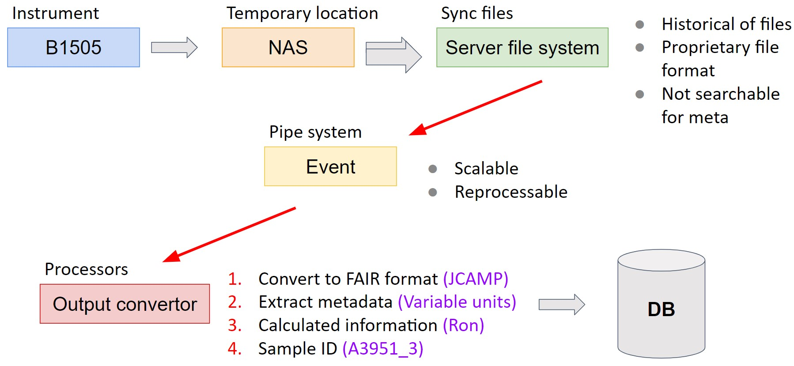
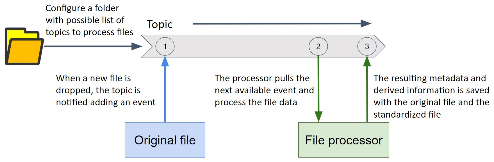
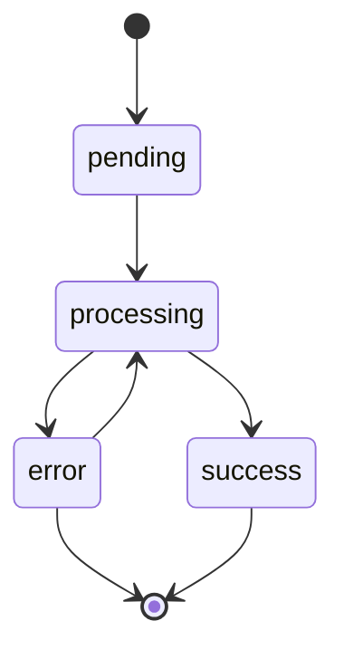
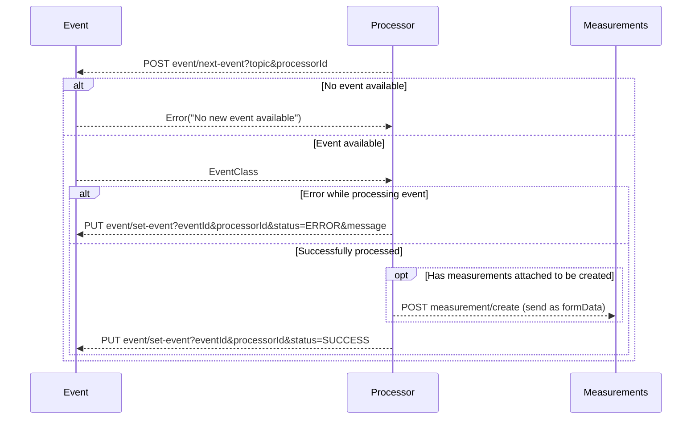

# Events manager

## Introduction

An event is the middle point that works as a pipe system for possible complex
computational problems. In this specific case it's mainly used for a new file
added to the file system, where the listener service creates an event and the
processors are listening for specific types of events.

When the processor pulls an event with a given "topic", the event manager blocks
it for another processor, this way is possible to parallelize the file processing

## Possible states

- `pending`: Event that has not been processed or read
- `processing`: Event that has been requested from a processor
- `success`: Event that has been marked as finished as successful
- `error`: Event that has been marked as finished as errored (could be reprocessed later)

## REST API

A normal process for the API used in the [base processor](https://github.com/mylims/base-processor) library will follow the next sequence.

- event = `http://localhost:3333/addons/events`
- measurement = `http://localhost:3333/measurements`

