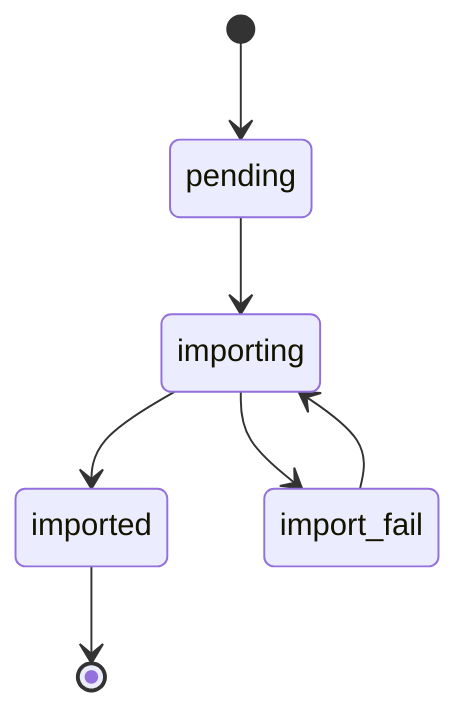
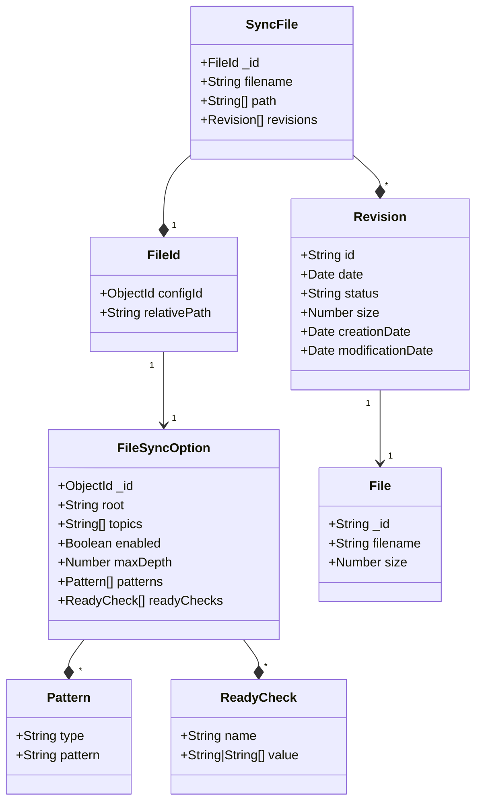

# file-sync

- [Configuration](#configuration)

## Usage

Please be sure to have run previously the installation and configuration on the
[backend](../../README.md#installation) and the
[frontend](../../frontend/README.md#installation).

After is required to have created an user:

```shell
node ace user:create
```

Now we can configure the different steps for the file synchronization. First you
need to add the `root` field (where you want to copy the files) in the
`localhost:3333/admin` server configuration, also is required to activate the addon.
Secondly you need to login in the current frontend instance at
`localhost:3000/login`. There in the tab _File synchronization_ you can create a
synchronization rule, meaning that this rule is going to be imported.

When the configurations are saved we can safely run

```shell
node ace file:sync
node ace file:import
```

## Process description

The `file:sync` command is used to search on the specified path and rules from
the a given configuration all the files, and based on their `modificationDate`
and `size` properties checks if was already treated or if needs to be imported.
This has the intention to track a history of changes on a file and make possible
to parallelize the processing of these files.

When the `file:sync` process notifies a new file or new file version, the
`file:import` command will import the file and save it as a new file, updating
the information on the sync file and notifying to the event system.

## File "ready criteria"

This is done in the library [is-my-file-ready](https://github.com/zakodium/is-my-file-ready).

- `editTime`: The edition time of the file is the same
- `endsWithBytes`: The end of the file matches the list of given bytes
- `endsWithStr`: The end of the file matches the string
- `sameSize`: The size of the file matches the given size

## File status

A file on the importation system moves in the following states, allowing to
import the files previously synchronized and that matches the "ready criteria"



## Models


