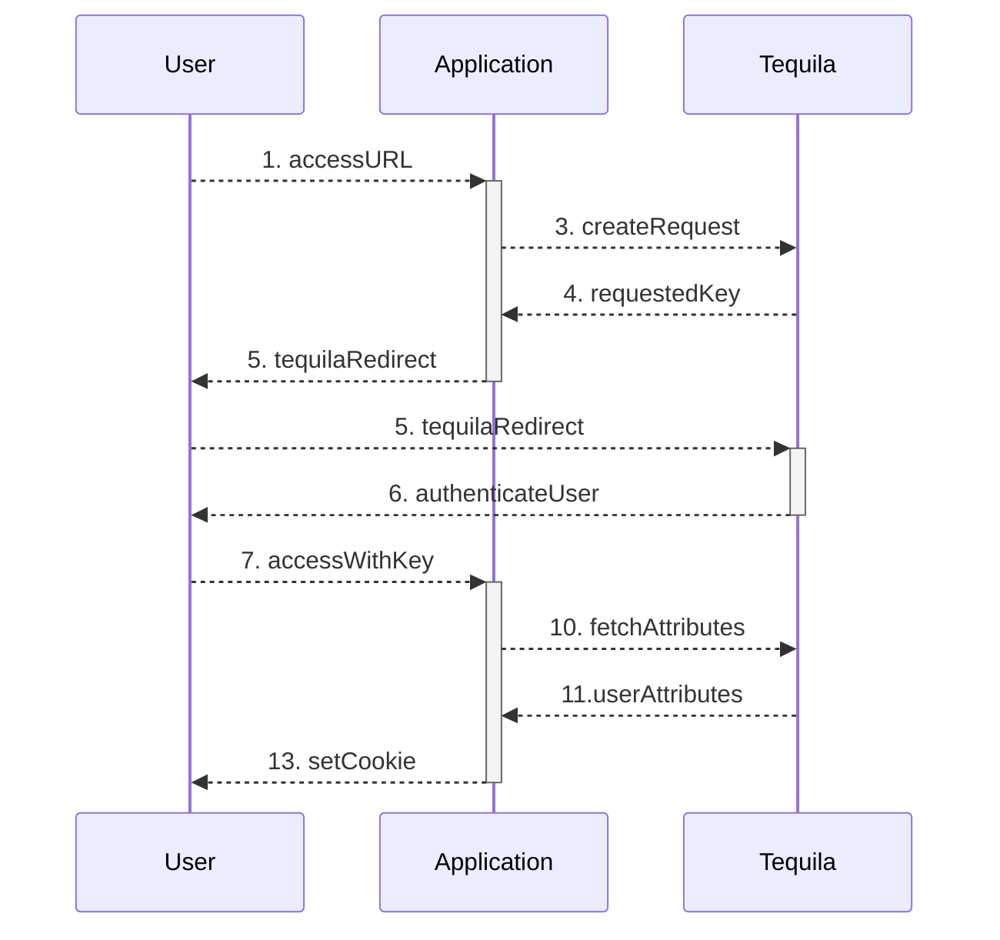

# Tequila v2.0 client

> Claude Lecommandeur (EPFL - KIS) [claude.lecommandeur@epfl.ch]

## General principles

There are 3 actors in the Tequila authentication process. A people with a
browser (**User**), tries to access a protected Web application
(**Application**). The Client uses the service of a Tequila server
(**Tequila**) to authenticate the User and get some information about him. The
scenario is the following :

1. **User** access an URL on **Application**.
2. **Application** tries to find a key value either in the URL or in a cookie.
3. If there is no key, **Application** calls an URL on **Tequila** with the
   `createrequest` command. It sends along the description of the request. If
   **Application** is a resource (see below), it just sends its resource name. In
   the other case, it sends all the characteristics of the request. There is many
   of them, the most important are the URL where to redirect the user after
   authentication (urlaccess), the attributes values the client wants to know
   (request), the service name (service), etc...
4. **Tequila** stores the attributes of the request and responds with a random
   hexadecimal request key.
5. **Application** reads this key and redirects **User**'s browser to
   **Tequila** URL plus the request key.
6. **Tequila** recognize the key, fetch the corresponding authentication request
   and does what it is meant to do, authenticate User, fetch attributes values
   about him, check if constraints are met, and if everything is OK, redirects User
   to `urlaccess` plus the request key as a parameter. Optionally Server deposit a
   specially crafted cookie it can recognize later in User's browser.
7. **Application** will see **User** comes back, but this time, it finds the
   request key it was waiting for.
8. It first tries to see it there is a session already opened for this key.
9. If there is, **User** is given access to the services of **Application**.
10. But just after **User** returns from **Tequila**, there is no such session.
    So, **Application** calls another URL on **Tequila** with the command
    `fetchattributes`, along with the request key.
11. **Tequila** sends back the values of the attributes relative to **User**.
    All the attributes that you can ask about the user are documented here:
    https://tequila.epfl.ch/serverinfo.
12. **Application** creates a Session for **User** with all the attributes
    values stored in it for future use.
13. **Application** also set a cookie in **User**'s browser with a session key.

This scenario can be visualized as following

We are trying to describe here the Client's job. So we have to fill steps 2, 3,
5, 7, 8, 9, 10, 12 and 13. Managing sessions is not mandatory but is is much
more efficient. If you don't, you will go to Tequila for every page User asks for.
